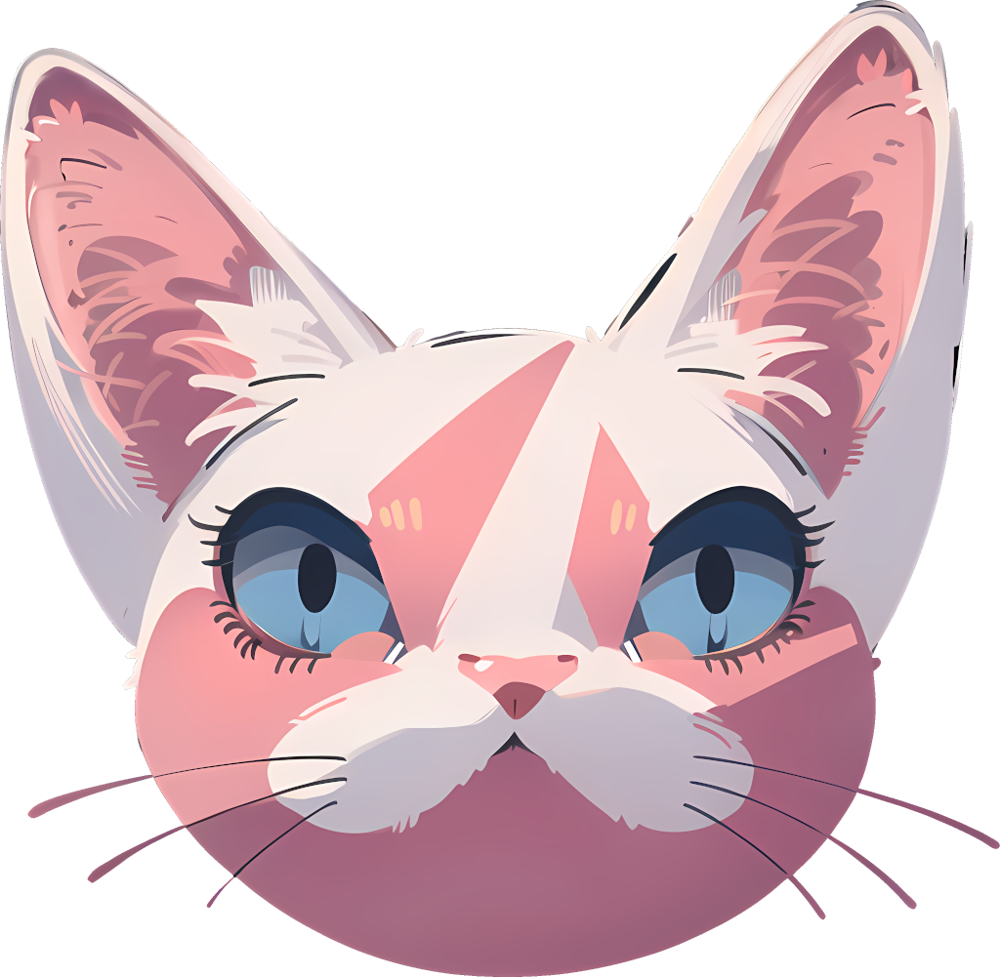

.. raw :: html

    <h1 align="center">SphynxBOT</h1>

    

        

        
    

SphynxBOT is a multipurpose discord bot I'm developing for my own use. The project is created with `discord.py <https://github.com/Rapptz/discord.py>`_ and connects to ``PostgreSQL`` database.

Features
--------
* On-demand cinema and TV information with interactive user interface, available through application commands. Provided by `TMDB <https://www.themoviedb.org>`_.
* A system of reminders, including those that fire once and those that repeat periodically at specified time.
* Converting between various units (distance, weight etc).
* Multiple dice rolling functionalities.
* And more to come in the future!

Deploying your own instance
---------------------------

